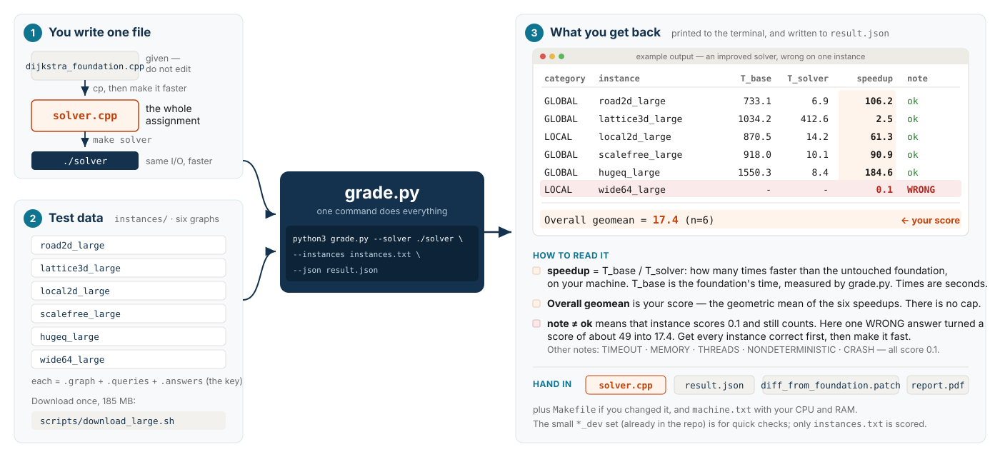

# Shortest-Path Algorithms Competition

You are given a working Dijkstra implementation, `dijkstra_foundation.cpp`.
Copy it to `solver.cpp` and make it faster. Same input, same output, less time.

**Your entire job is one C++ file.** Everything else — downloading the data,
timing, checking answers, computing the score — is done for you by one Python
script, `grade.py`. You hand in `solver.cpp` and the `result.json` it writes.

## How the pieces fit



You only touch `solver.cpp`. One command produces the table on the right, and
the `Overall geomean` line is your score.

## Quick start

```sh
make foundation                        # 1. build the baseline
scripts/download_large.sh              # 2. fetch the scored data (185 MB, once)
cp dijkstra_foundation.cpp solver.cpp  # 3. this file is your assignment
make solver                            #    ...edit solver.cpp, rebuild...
python3 grade.py --solver ./solver --instances instances.txt --json result.json   # 4. score
```

Step 4 prints a table and writes `result.json`. Before you change anything,
`solver.cpp` *is* the foundation, so every speedup is about 1.0. This is a real
run on the dev set (see below), times in seconds:

```
category instance                        T_base   T_solver   peakRSS    speedup  note
GLOBAL   road2d_dev.graph                 6.361      6.145        9M      1.035  ok
GLOBAL   lattice3d_dev.graph             37.616     38.482       11M      0.977  ok
LOCAL    local2d_dev.graph                2.824      2.793        5M      1.011  ok
GLOBAL   scalefree_dev.graph             19.065     19.278        5M      0.989  ok
GLOBAL   hugeq_dev.graph                 24.718     24.188        9M      1.022  ok
LOCAL    wide64_dev.graph                 6.181      6.073        5M      1.018  ok

Overall                 geomean = 1.009  (n=6)
```

As you improve `solver.cpp` the `speedup` column grows. An illustrative result
for a solver that is much faster on four instances, modestly faster on one, and
wrong on one:

```
category instance                        T_base   T_solver   peakRSS    speedup  note
GLOBAL   road2d_large.graph             733.1        6.9      210M    106.245  ok
GLOBAL   lattice3d_large.graph         1034.2      412.6      180M      2.506  ok
LOCAL    local2d_large.graph            870.5       14.2      160M     61.303  ok
GLOBAL   scalefree_large.graph          918.0       10.1      190M     90.891  ok
GLOBAL   hugeq_large.graph             1550.3        8.4       40M    184.560  ok
LOCAL    wide64_large.graph                 -          -      900M      0.100  WRONG

Overall                 geomean = 17.361  (n=6)
```

`note=ok` means your answers were correct. Anything else means that instance
scored 0.1 — the `WRONG` line above cost this solver most of its score (without
it the mean would be about 49). Correctness first, then speed.

That is the whole workflow. Repeat step 4 as you improve `solver.cpp`.

### Iterating quickly

The scored run takes a while (the unmodified foundation needs about 1.7 h of
CPU for all six instances). While you work, use the small dev set, which is
already in the repo and takes the foundation about 1.5 minutes:

```sh
python3 grade.py --solver ./solver --instances instances_dev.txt
```

The dev set is for checking correctness and rough speed. Only `instances.txt`
is scored.

## The rules

Your `solver.cpp` must:

1. Be a modified copy of `dijkstra_foundation.cpp`, not a rewrite from scratch.
2. Keep the command line: `./solver <graph> <queries> <output>`.
3. Produce exactly the foundation's output on every instance (`-1` for
   unreachable).
4. Be C++17 using only the standard library.
5. Be single-threaded.
6. Stay under 4 GB of memory and 3600 s per instance.
7. Not contain precomputed answers.

Do **not** edit `dijkstra_foundation.cpp`. `grade.py` compiles it itself to
measure the baseline; editing it would change your own baseline.

`grade.py` enforces rules 3, 5 and 6 automatically. Rules 1, 4 and 7 are
checked by reading your `solver.cpp`.

## What to submit

- `solver.cpp` (plus any headers you added, and the `Makefile` if you changed it)
- `result.json`, written by step 4

Nothing else. `result.json` already records your times, the baseline times,
and the score.

## How the score works

For each instance, `speedup = T_base / T_solver`, where `T_base` is the
unmodified foundation and `T_solver` is your program, both timed by `grade.py`
on your machine. Your score is the geometric mean of the six speedups.

- **There is no cap.** 400x faster scores 400.
- **A failed instance scores 0.1 and still counts.** Wrong answers, a timeout,
  too much memory, or extra threads on one instance drag down your mean; they
  are never dropped.
- Two instances are **LOCAL** (mostly short-range queries), four are **GLOBAL**
  (long-range). `grade.py` also reports the two sub-means, but the overall
  geometric mean is your score.

### What the notes mean

| note | meaning | score for that instance |
|---|---|---|
| `ok` | correct, timed | `T_base / T_solver` |
| `WRONG` | output differs from the answer key | 0.1 |
| `TIMEOUT` | exceeded 3600 s | 0.1 |
| `MEMORY` | exceeded 4 GB | 0.1 |
| `THREADS` | used more than one thread | 0.1 |
| `NONDETERMINISTIC` | the three timing runs gave different output | 0.1 |
| `CRASH` / `NOOUTPUT` | non-zero exit, or no output file written | 0.1 |

## The data

Six instances are scored. Each is a different kind of graph, so a trick that
helps on one may not help on another:

| instance | vertices | edges | queries | what it is |
|---|---:|---:|---:|---|
| `road2d_large` | 300,304 | 1,629,732 | 200,000 | directed road network with coordinates |
| `lattice3d_large` | 300,763 | 902,289 | 30,000 | 3-D torus lattice, degree 6 |
| `local2d_large` | 300,304 | 600,608 | 300,000 | 2-D lattice; 90 % of queries are short-range |
| `scalefree_large` | 300,000 | 873,003 | 50,000 | directed, power-law degrees, 3 % of targets unreachable |
| `hugeq_large` | 50,176 | 271,492 | 600,000 | small road graph, very many queries |
| `wide64_large` | 1,999,396 | 3,998,792 | 30,000 | distances exceed 2³² — use 64-bit distances |

Each instance is three files in `instances/`: `<name>.graph`, `<name>.queries`
and `<name>.answers` (the key `grade.py` checks you against), plus a
`<name>.meta.json` describing it (V, E, weight range, query mix, max distance).

The `_dev` versions of the same six families are small (about 50k vertices,
10k queries) and committed to the repo.

**The final grading uses fresh instances** generated by the same code with the
same parameters and a different random seed. Anything that depends on the
exact bytes of the released files will not carry over; anything that depends
on the structure of the graphs will.

## File formats

Vertex indices are 0-based.

```
<graph>                 <queries>           <output>
V E FLAGS               Q                   d_1
u_1 v_1 w_1             s_1 t_1             ...
...                     ...                 d_Q       (-1 if unreachable)
u_E v_E w_E             s_Q t_Q
[x_0 y_0                 (coordinates, only if FLAGS bit 0 is set)
 ...
 x_{V-1} y_{V-1}]
```

`FLAGS` bit 0 (value 1): a coordinate block follows the edges. Bit 1 (value 2):
the graph is **directed** and `u v w` is the arc `u -> v` only; otherwise each
line is an undirected edge. Coordinates are integers. Weights are positive and
fit in `int32`; **distances may not fit in 32 bits**.

## Everything else (optional reading)

**Sanity-check your environment** before you start:

```sh
make foundation && make check-data
```

This runs the foundation on the dev set and compares it with the shipped
answer keys. If it reports anything other than `ok`, your toolchain is broken —
ask before going further.

**How `T_base` is measured.** Running the unmodified foundation on all
600,000 queries of an instance would take up to half an hour each time you
score yourself, so `grade.py` times it on two short prefixes of the query file
and extrapolates (parsing cost plus per-query cost). The error is a few
percent and identical for everyone on a given instance. Pass `--baseline-full`
on a dev instance to see the extrapolation checked against a full run.

**Your solver is run three times** and the best time is kept. Machine noise is
a few percent, so don't chase improvements smaller than that.

**Timings are machine-dependent**, so `T_base` and `T_solver` are always
measured on the same machine in the same run. Close other programs while
scoring. The times above are from an Apple-silicon laptop; an older machine may
take twice as long.

**Practice instances.** `tools/gen/` is the real generator. To make fresh
instances with your own seed:

```sh
make tools                                          # builds tools/ref/refsolve
python3 -m tools.gen --manifest tools/manifest/public.json \
        --instance road2d_dev --seed 12345 --salt mine --out mydata
tools/ref/refsolve plan mydata/road2d_dev.graph mydata/road2d_dev.qplan \
        mydata/road2d_dev.queries mydata/road2d_dev.answers
```

Then list them in your own instances file in the same `<category> <graph>
<queries>` format and point `--instances` at it. `grade.py` finds the
`.answers` file next to the `.queries` file automatically.

**`tools/` is instructor tooling.** It is not part of your submission and is
not subject to the rules above.

| make target | what it does |
|---|---|
| `make foundation` | build the baseline |
| `make solver` | build your `solver.cpp` |
| `make check-data` | verify the dev answer keys against the foundation |
| `make tools` | build the reference solver used to make practice instances |
| `make test` | run `grade.py`'s own regression tests |
